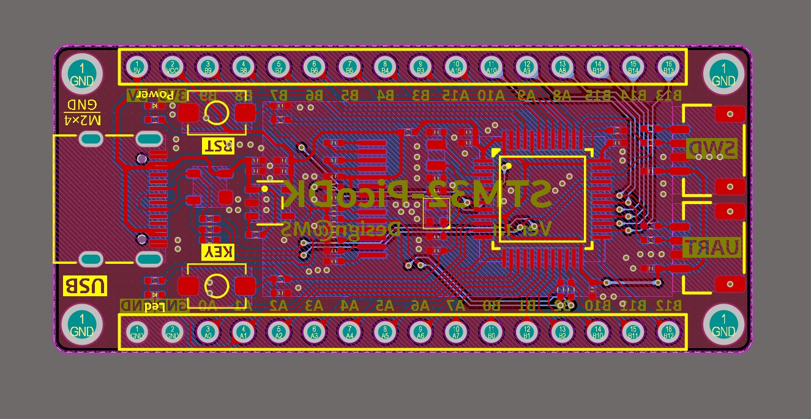
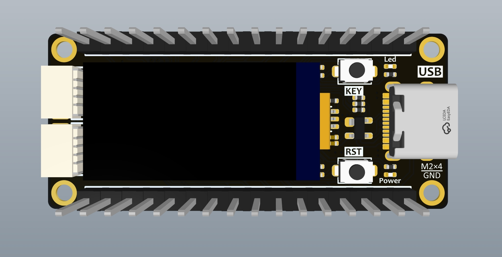
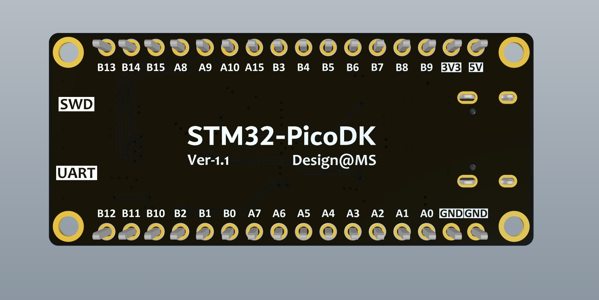

# 基于STM32F103C8T6的迷你开发板
---
>* Coretx-M3架构，72MHz主频
>* 20KB RAM，128KB FLASH
>

由于gcc编译代码太大，工程使用clion cmake采样keil同款armclang编译器进行编译

## 特征

---

- 引出绝大部分GPIO
- 板载一个OLED、一个用户LED、一个用户按键
- 迷你尺寸50×22mm

